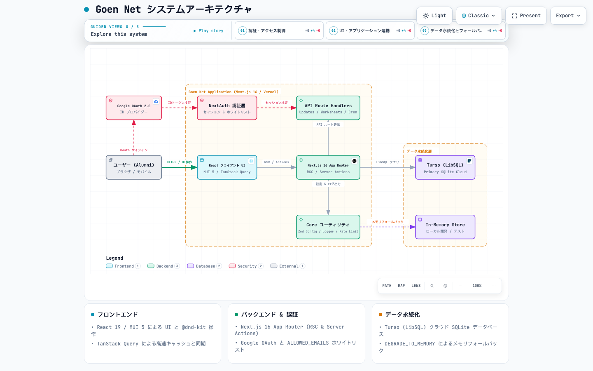

# Goen Net

Goen Net is a supportive mentoring network for visionary leaders who are committed to creating and innovating society. Modeled after EO Forum, it brings together 7–10 peers who meet quarterly to reflect on their work and lives, disclose real challenges, and learn from one another through candid, experience-based sharing. The structure emphasizes trust, punctuality, and absolute confidentiality so members can grow through self-awareness, gain practical perspectives for resolving issues, and build lasting bonds with fellow leaders.

## ✨ Key Capabilities

- **Updates board** – Capture member updates, flag urgent items, and surface the latest activity in real time.
- **Prioritization workflow** – Drag-and-drop prioritization queues backed by consistent scoring rules.
- **Meeting worksheets** – Moderator, presenter, observer, and coach worksheets that guide every role through the agenda.
- **Authenticated workspace** – Google sign-in via NextAuth keeps private data scoped to your organization only.
- **Turso-backed persistence** – A LibSQL database stores updates and meeting metadata with low-latency reads.

## 🧰 Tech Stack

- Next.js 16 (App Router, React Server Components, Turbopack)
- TypeScript + React 19
- NextAuth with Google OAuth2 provider
- Turso (LibSQL) for transactional storage
- MUI 5 for design system components
- Vitest + Playwright for automated testing
- ESLint 9 for linting

## 🏛️ Architecture

[](./docs/architecture.html)

> 💡 **インタラクティブ図**: [docs/architecture.html](./docs/architecture.html) を開くと、テーマ切り替え (Light / Dark)・ズーム操作・フロー別フォーカス表示に対応した対話型アーキテクチャ図が利用可能です。

## 🚀 Getting Started

1. **Install dependencies**

   ```bash
   bun install
   ```

2. **Create your environment file**

   ```bash
   cp .env.example .env.local
   ```

   | Variable                                     | Description                                                                                                               |
   | -------------------------------------------- | ------------------------------------------------------------------------------------------------------------------------- |
   | `NEXTAUTH_URL`                               | Base URL of the app (e.g. `https://yourdomain.com`).                                                                      |
   | `NEXTAUTH_SECRET`                            | Random 32+ character string used to sign NextAuth sessions.                                                               |
   | `GOOGLE_CLIENT_ID` / `GOOGLE_CLIENT_SECRET`  | OAuth credentials from the Google Cloud Console.                                                                          |
   | `ALLOWED_EMAILS`                             | Comma- or whitespace-separated list of Google accounts permitted to sign in. Leave blank to block all Google accounts.    |
   | `TURSO_DATABASE_URL` / `TURSO_DB_AUTH_TOKEN` | Connection details for the Turso (LibSQL) database. `TURSO_DB_URL` is also accepted if you prefer that naming convention. |

   **Optional helpers**

   | Variable            | Description                                                                                     |
   | ------------------- | ----------------------------------------------------------------------------------------------- |
   | `DEGRADE_TO_MEMORY` | Set to `1` to bypass Turso and use the in-memory datastore instead (helpful for local testing). |

3. **Run the application**

   ```bash
   bun run dev
   ```

   The app runs at `http://localhost:3001`. Unauthenticated users are redirected to `/signin` and sent back once Google sign-in succeeds.

## 📁 Project Structure (excerpt)

- `src/app/` – App Router entry point, layouts, and page routes.
- `src/app/(protected)/` – Authenticated areas including updates, prioritization, documentation, and worksheets.
- `src/app/api/` – Route handlers for authentication, sessions, and data APIs.
- `src/components/` – Shared UI elements such as the navbar, session provider, and sign-out button.
- `src/lib/` – Server utilities for auth, Turso client access, and helper functions.
  - `src/lib/logger.ts` – Structured logging system with environment-aware output.
  - `src/lib/config.ts` – Environment variable validation using Zod.
- `tests/` – Vitest API tests and Playwright end-to-end suites.

## 🔧 Code Quality & Development Tools

### Structured Logging

The project uses a custom structured logging system (`src/lib/logger.ts`) that outputs JSON-formatted logs:

```typescript
import { logger } from "@/lib/logger";

logger.debug("Debug message", { context: "additional data" });
logger.info("Info message", { userId: "123" });
logger.warn("Warning message", { reason: "something unexpected" });
logger.error("Error message", { error: errorObject });
```

- **Development**: All log levels are output
- **Production**: Only `warn` and `error` are output
- Console methods are restricted by ESLint (`no-console` rule)

### Environment Variable Validation

Environment variables are validated at startup using Zod (`src/lib/config.ts`):

```typescript
import { getConfig, hasEnv, isTursoDatabaseConfigured } from "@/lib/config";

const config = getConfig(); // Automatically validates all env vars
const apiKey = config.GOOGLE_CLIENT_ID;

if (hasEnv("RESEND_API_KEY")) {
  // Email functionality is available
}
```

If validation fails, the app will not start and will display detailed error messages indicating which environment variables are missing or invalid.

## 🧪 Testing and Linting

- `bun run lint` – Run ESLint across the project.
- `bun run test` – Execute the full Vitest unit suite.
- `bun run test:playwright` – Launch Playwright end-to-end tests (requires `PLAYWRIGHT_TEST_EMAIL` and `PLAYWRIGHT_TEST_PASSWORD`).

## ☁️ Deployment

The project is optimized for Vercel. Configure every required variable from the table above (`NEXTAUTH_*`, `GOOGLE_CLIENT_*`, `ALLOWED_EMAILS`, and your preferred `TURSO_*` names) in the Vercel dashboard. Optional helpers such as `DEGRADE_TO_MEMORY` are rarely needed in production. Update your Google OAuth redirect URIs to match the production domain before going live.

## 🤝 Contributing

1. Fork and clone the repository.
2. Create a feature branch.
3. Run linting and tests before opening a pull request.

Issues and suggestions are welcome—please include as much context as possible to keep iterations fast.
